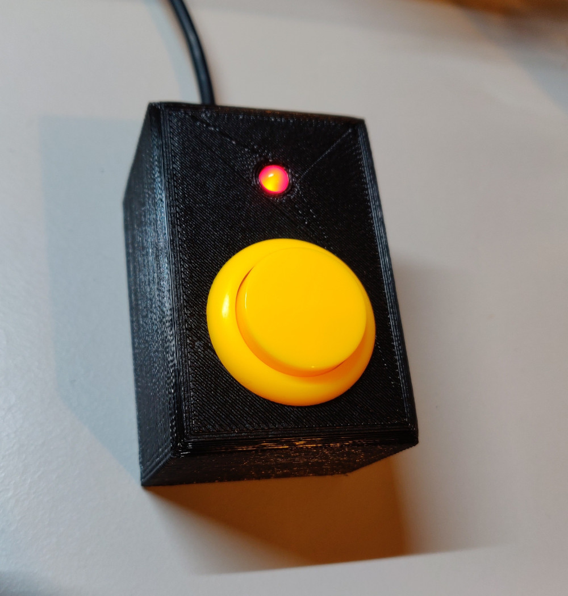

# MuteButton
A digispark based mute-button for attaching to PC.

See MuteButton for arduino project for the digispark.
See case for 3d models for a case using a LED and a arcade button.

The device looks like this:

## Operation
The device always starts in unmuted state (as there is no backchannel to read the mute information from the system).
When pushing the button, the configured mute command is sent to the PC as keyboard keystroke and the LED is switched on to show that the system is now muted.
When pushing the button again, the configured mute command is sent to the PC as keyboard keystroke and the LED is switched off to show that the system is now unmuted.
In muted state, you can keep the button pushed. On pressing the button, the system is unmuted and on releasing it, it is muted again. The button needs to be pushed for at least 500ms for this "push-to-talk" mode to be activated. The led blinks while this mode is active.

## Links
For a more detailed description see this blog post: https://lars-ra.blogspot.com/2021/04/mute-button-for-conference-calls.html
